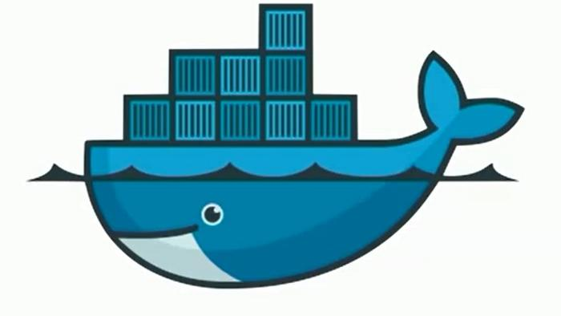
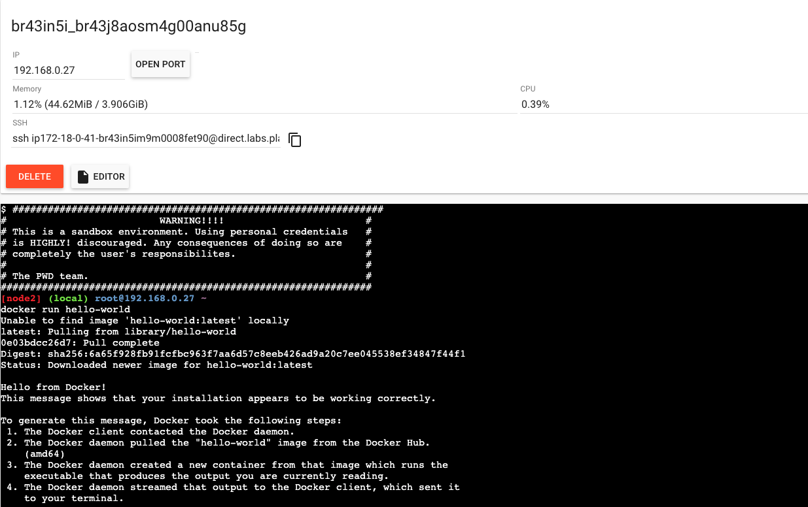
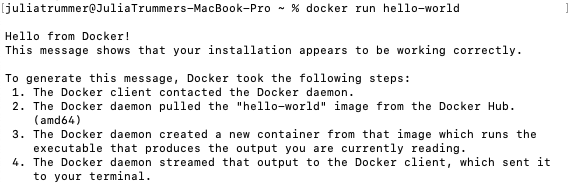

# Docker Demo

## Installation
### Mac
https://docs.docker.com/docker-for-mac/install/
### Linux
https://docs.docker.com/engine/install/
### Windows
https://docs.docker.com/docker-for-windows/install/
### PlayWithDocker
Bei Docker **Registrieren oder Anmelden** :
https://labs.play-with-docker.com/
## First Start - Hello World
### PlayWithDocker
`<root@192.168.0.27 ~ docker run hello-world>`

### Docker Desktop
`<root@192.168.0.27 ~ docker run hello-world>` 

## Docker vs. Virtual Machine
| Docker                                           | Virtual Machine                                                |
|--------------------------------------------------|----------------------------------------------------------------|
| funktioniert über Linux Kernel Techniken         | emuliert Hardware                                              |
| Namespaces sind vom Hauptsystemabgetrennt                                                        
 können trotzdem auf den Linux Kernel zugreifen   | Abtrennung mit eigenem Bootloader, Kernel und  emulierten BIOS | 
| ähnlich wie ein Prozess                          |                                                                |
## Image vs. Docker Container
| Images                           | Container            |
|----------------------------------|----------------------|
| wie Programm                     | wie Prozess          |
| ist Datenbasis für die Container | sind laufende Images |
